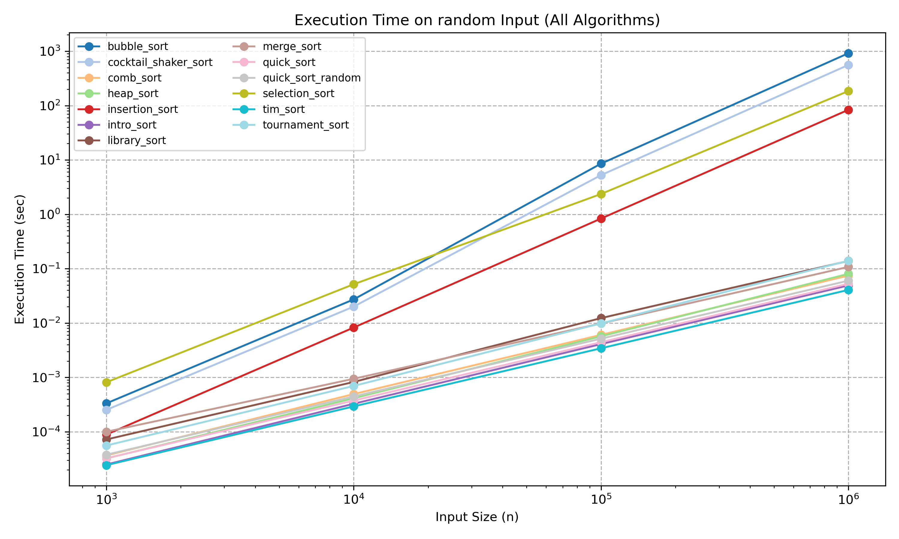

# 🔢 Sorting Algorithm Benchmark Project

<a href="https://hoonably.github.io/files/Sorting_Algorithm_Analysis_and_Implementation.pdf"></a>

> A comparative study of 12 classical and modern sorting algorithms  
> 📊 Performance • 🧠 Memory • 🧩 Stability • ✅ Accuracy

---

## 🔥 Key Highlights



- 🥇 **Fastest Algorithm**: Tim Sort (0.0407s on 10⁶ elements)
- ✅ **Most Stable**: Merge, Tim, Insertion, Bubble
- 🧠 **Memory Efficient**: In-place methods (Quick, Heap, Selection)
- 🧪 Full results in [PDF report](./Sorting_Algorithm_Analysis_and_Implementation.pdf)

---

## 📘 Overview

This project was conducted as part of the **CSE331: Algorithm** course at **UNIST**.  
It implements and benchmarks 12 sorting algorithms in C++ under consistent experimental conditions.

Goals:
- Study algorithmic trade-offs in real-world settings
- Evaluate runtime, memory, stability, and accuracy
- Understand sensitivity to input order and data types

---


## 📁 Directory Structure

```bash
.
├── basic_sorting/            # Classical sorting algorithms
│   ├── bubble_sort.cpp
│   ├── heap_sort.cpp
│   ├── insertion_sort.cpp
│   ├── merge_sort.cpp
│   ├── quick_sort.cpp
│   ├── quick_sort_random.cpp
│   └── selection_sort.cpp
├── advanced_sorting/         # Advanced sorting algorithms
│   ├── cocktail_shaker_sort.cpp
│   ├── comb_sort.cpp
│   ├── intro_sort.cpp
│   ├── library_sort.cpp
│   ├── tim_sort.cpp
│   └── tournament_sort.cpp
├── test_algo/                # Main performance benchmarking (runtime)
│   ├── main.cpp
│   ├── benchmark.py
│   └── results/
├── test_memory/              # Memory usage benchmark
│   ├── main.cpp
│   ├── benchmark.py
│   └── memory_graph
├── test_stability/           # Stability testing
│   ├── main.cpp
│   ├── benchmark.py
│   ├── stability.csv
│   ├── input/
│   └── output/
├── test_type/                # Data type sensitivity benchmark
│   ├── main.cpp
│   ├── benchmark.py
│   └── results/
├── utils/                    # Input generation scripts
│   ├── input_generator.py
│   └── stability_input_generator.py
├── .gitignore
└── README.md                 # You're here!
```

---

## ⚙️ How to Run

This project includes four main experimental modules. Each one contains a C++ binary for core sorting logic and a Python script for benchmarking and logging results.

---

### 🔹 1. Algorithm Performance Benchmark (`test_algo`)

**Purpose**: Measure average runtime of 12 sorting algorithms on random and structured inputs of various sizes.

```bash
cd test_algo
python3 benchmark.py
```

Results will be saved in the `results/` directory.

---

### 🔹 2. Memory Usage Benchmark (`test_memory`)

**Purpose**: Measure peak memory usage (`ru_maxrss`) during execution of each sorting algorithm.

```bash
cd test_memory
python3 benchmark.py
```

Output will be stored in `results_memory.csv`.

---

### 🔹 3. Stability Analysis (`test_stability`)

**Purpose**: Test whether each algorithm preserves the relative order of equal elements (stability).

```bash
cd test_stability
python3 benchmark.py
```

- Input samples are in the `input/` folder  
- Sorted outputs are written to `output/`  
- Final stability report is saved as `stability.csv`

---

### 🔹 4. Data Type Sensitivity Benchmark (`test_type`)

**Purpose**: Evaluate how sorting performance changes with different numeric types (`int`, `long long`, `float`, `double`).

```bash
cd test_type
python3 benchmark.py
```

Results are stored in the `results/` directory.

---

## 📈 Implemented Algorithms

| Category  | Algorithms                                                                 |
|-----------|----------------------------------------------------------------------------|
| Basic     | Merge Sort, Heap Sort, Bubble Sort, Insertion Sort, Selection Sort, Quick Sort |
| Advanced  | Intro Sort, Tim Sort, Library Sort, Tournament Sort, Comb Sort, Cocktail Shaker Sort |

*Note: `Quick Sort (Random)` is implemented as a variant in `basic_sorting/quick_sort_random.cpp`*

---

## 📊 Evaluation Metrics

- **Runtime**: Average over 10 trials
- **Input Types**: Random, Sorted, Reverse, Partially Sorted
- **Data Types**: `int`, `long long`, `float`, `double`
- **Stability**: Repeated tests with duplicate-value inputs
- **Accuracy**: Based on adjacent inversion rate  
  \[
  \text{Accuracy} = 1 - \frac{\text{\# of inversions}}{n - 1}
  \]
- **Memory Usage**: Resident memory via `ru_maxrss` sampling

---

## 🔬 Summary of Results

### 🥇 Performance Ranking (n = 10⁶, Random Input)

| Rank | Algorithm        | Runtime (sec) |
|------|------------------|----------------|
| 1    | Tim Sort         | 0.0407         |
| 2    | Intro Sort       | 0.0492         |
| 3    | Quick Sort       | 0.0528         |
| 4    | Merge Sort       | 0.1079         |
| 5    | Library Sort     | 0.1387         |
| ...  | ...              | ...            |
| 12   | Bubble Sort      | 916.645        |

### ✅ Stability Check

| ✅ Stable                          | ❌ Unstable                                  |
|-----------------------------------|---------------------------------------------|
| Merge, Insertion, Bubble, Tim     | Quick, Heap, Selection, Library, Intro      |

### 🧠 Memory Usage (n = 10⁵, int)

- **In-place**: Quick, Heap, Insertion, Selection
- **High Overhead**:  
  - Library Sort: +2600KB  
  - Tournament Sort: +1450KB  
  - Merge Sort: +947KB

---

## 📝 Notes

- All algorithms are implemented from scratch with consistent interfaces
- Library Sort follows [Faujdar & Ghrera, 2015] with adaptive gap rebalancing  
  → Minor accuracy drops (~1%) on large random inputs

---
